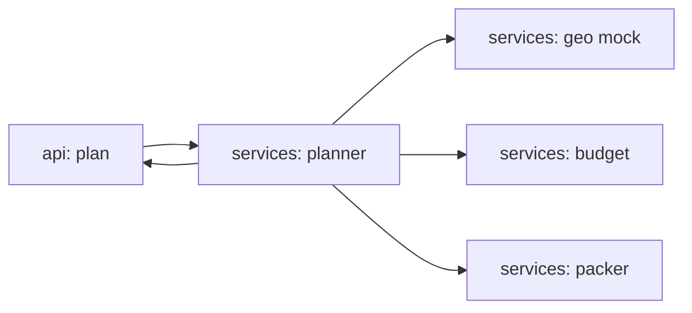

# agent-travel-planner

[](https://github.com/Shamanchi/agent-travel-planner/actions/workflows/ci.yml)
[](https://www.python.org/)
[](./Dockerfile)
[](./LICENSE)

> **English TL;DR:** FastAPI agent that builds a trip plan — day-by-day itinerary, cost estimate vs budget, packing checklist. Two scenarios (`city` / `relax`), mock destination database, fully offline.

Агент планирования путешествий: по направлению, дням, бюджету и интересам строит маршрут по дням, считает смету и выдаёт чек-лист сборов. Два сценария — `city` (городской уикенд) и `relax` (спокойный отдых). База направлений — mock-фикстуры, работает офлайн.

Источник темы: `Hands-On-AI-Engineering / P-111 (ai_travel_planning_agent) + P-144 (travel_planner_agent)` — идеи и постановку взяли из каталога, код и тексты написаны с нуля.

## Какую задачу решает

Путешественнику нужен за минуту черновой план: что смотреть по дням, влезет ли поездка в бюджет, что положить в чемодан. Агент берёт направление из встроенной базы (или generic-профиль для неизвестного города), раскладывает достопримечательности по дням с учётом интересов и стиля, считает смету и выдаёт чек-лист.

## Архитектура



Слои: `api/` → `services/` → `core/`, настройки через `pydantic-settings`.

## Быстрый старт

```bash
cp .env.example .env
pip install -r requirements.txt
uvicorn app.main:app --reload
curl -X POST http://127.0.0.1:8000/api/v1/plan -H "Content-Type: application/json" -d "{\"destination\": \"Paris\", \"days\": 3, \"budget\": 1500, \"style\": \"city\", \"interests\": [\"museums\", \"food\"]}"
```

Docker:

```bash
docker compose up --build
```

## API

- `GET /api/v1/health` — проверка сервиса.
- `GET /api/v1/destinations` — список направлений из mock-базы.
- `POST /api/v1/plan` — полный план: маршрут, смета, чек-лист. Тело: `{"destination": "Paris", "days": 3, "budget": 1500, "style": "city", "interests": ["museums"]}`. Стили: `city` / `relax`.
- `POST /api/v1/estimate` — только смета без маршрута.

Пример ответа `plan` (сокращённо):

```json
{
  "destination": "Paris",
  "days": 3,
  "style": "city",
  "itinerary": [{"day": 1, "items": ["Louvre (museums, 20)"]}],
  "estimate": {"total": 620.0, "within_budget": true},
  "packing": ["Passport", "Comfortable shoes"]
}
```

## Переменные окружения (.env)

| Переменная | Назначение | По умолчанию |
|---|---|---|
| `DEFAULT_CURRENCY` | Валюта сметы | `USD` |
| `DEFAULT_HOTEL_PER_DAY` | Отель/день для неизвестных городов | `100` |
| `DEFAULT_FOOD_PER_DAY` | Еда/день для неизвестных городов | `50` |
| `MAX_DAYS` | Макс. дней в плане | `30` |
| `APP_HOST` / `APP_PORT` | Хост/порт API | `0.0.0.0` / `8000` |

Полный список — в [.env.example](./.env.example).

## Тесты

```bash
pip install -r requirements.txt
pytest -q
pytest -q -m integration
```

Unit-тесты без сети (mock-база городов). Интеграционные (`-m integration`) — через TestClient, тоже без сети.

## Контакты

- Telegram: @PavelYrevichh
- Email: Lietman46@mail.ru
- GitHub: Shamanchi
- FL.ru: https://www.fl.ru/users/Shamanchi
